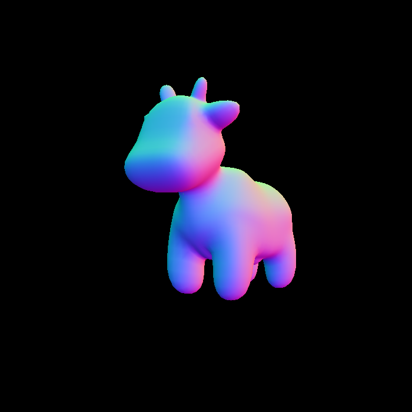
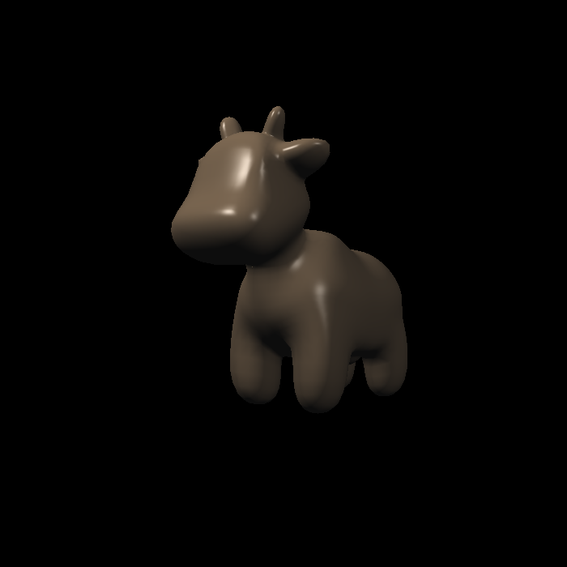
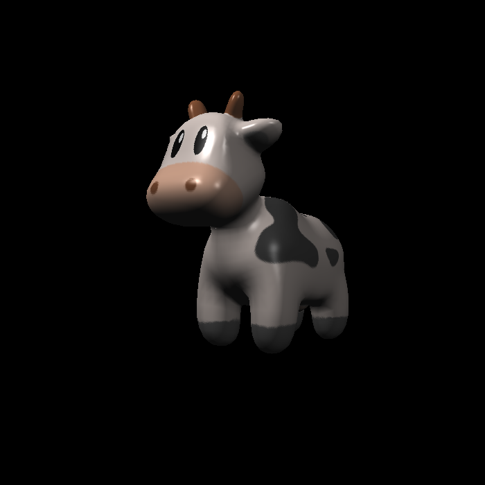
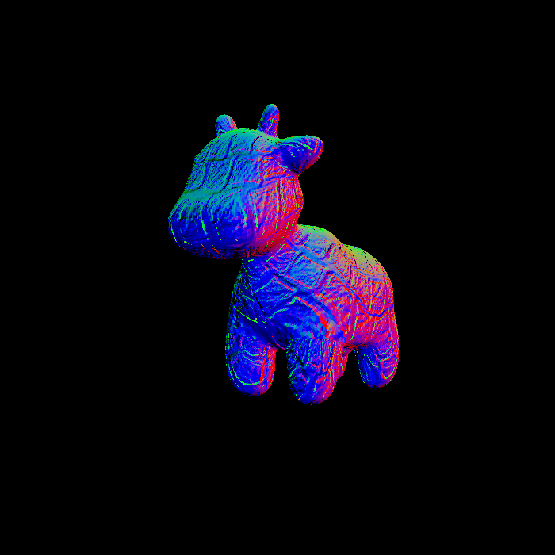
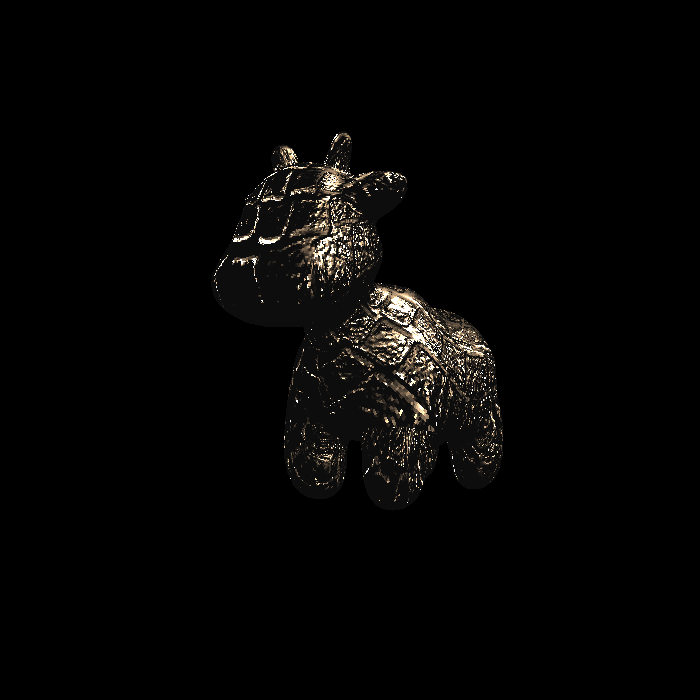

## 运行
注意，必须在build下运行，因为代码读取的是../models/xxxx

```shell
./Debug/Rasterizer.exe output.png texture
./Debug/Rasterizer.exe output.png normal
./Debug/Rasterizer.exe output.png phong
./Debug/Rasterizer.exe output.png bump
./Debug/Rasterizer.exe output.png displacement
```

## 效果图

初始


基础光线



基础纹理



凹凸



凹凸2


额外，双线性差值纹理， 色彩转换处更加平滑（需要放大看）

